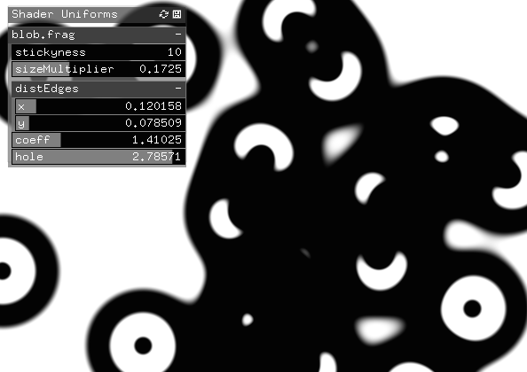

# ofxUniformGui

Easily add a user interface elements for your shader uniforms.

## Usage

First annotate your uniforms with a default value min and max, like this:

``` glsl
uniform float stickyness = 2.1; // 10.0-0.1
uniform float sizeMultiplier = 0.2;// 0.01 - 0.5
uniform vec2 distEdges = vec2(0.1, 0.9); // 0.0 - 1.0
uniform float coeff = 2; // 0.01 - 5
uniform float hole = 2.5; // 0 - 3

```

Then simply, use `ofxUniformGuiShader` instead of `ofShader` for your shaders. That's it, no `update()`s, no `draw()`s. Just use `load()`, `begin()` and `end()` on your shader like you usually do.



Each shader with GUI uniforms will be displayed in a seperate parameter group, with the shader name as the group name. The visiblity of the GUI can be toggled with the *u* key by default.

Supported types are `float`, `int`, `vec2` and `vec3`.

### Customisation

To access the GUI managing object, use the static `get` function, like:
```c++
ofxUniformGui::get()->setVisible(true);
ofxUniformGui::get()->setShowKey('s');
```

